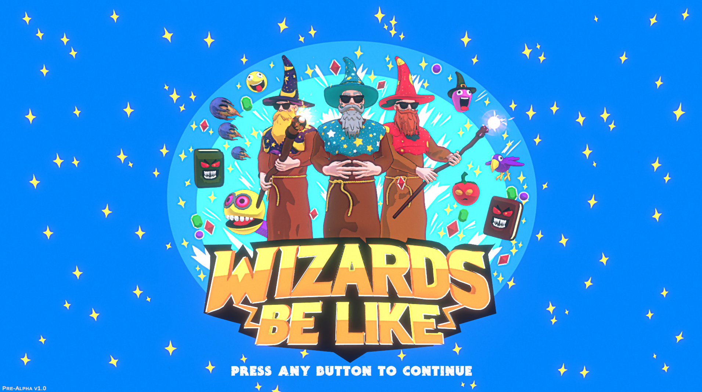

# Wizards Be Like (WBL)

## Overview
Wizards Be Like (WBL) is a 2.5D multiplayer PvP game that draws inspiration from timeless classics like Worms and Gunbound. In WBL, players choose from a variety of grimoires and items to participate in thrilling magical battles within interactive and destructible environments. 

## Features
- **Local Multiplayer PvP**: Engage in dynamic battles with other players locally in a single machine.
- **Destructible Environments**: Every stage has interactive elements that can be destroyed or altered.
- **Unique Stages**: 
  - **Testing Grounds**: A sandbox for testing game mechanics.
  - **The Wild West**: A themed stage with destructible buildings, horses, and cowboys.
  - **Outer Space**: Battle among UFOs and spaceships.
  - **Dungeons**: Dark and eerie with destructible dancing skeletons.
 
## Upcomming Features
- **Competitive Play**: Earn tokens and rewards through competitive matches. 
- **Marketplace**: Trade and collect cosmetic and seasonal items.

- ## Screenshots

*Title Art


*Character Selection Menu


*The Wild West Stage

## Technical Details
- **Engine**: Unity
- **Language**: C#
- **Platform**: PC

## Getting Started
To get a local copy up and running, follow these steps:

### Prerequisites
- Unity 2022.3.7f1 or later
- .NET 4.x

### Installation
1. Clone the repo:
    ```sh
    git clone https://github.com/eymardfreire/WBL.git
    ```
2. Open the project in Unity.

### Building the Project
To build the project for PC:
1. Open Unity.
2. Go to `File` -> `Build Settings`.
3. Select `PC, Mac & Linux Standalone` and choose the appropriate target platform (Windows, macOS, or Linux).
4. Click `Build` and select a location to save the build files.
5. 1080p resolution recommended for this build.

## Contributing
Contributions are what make the open source community such an amazing place to be, learn, inspire, and create. Any contributions you make are **greatly appreciated**.

If you have a suggestion that would make this better, please fork the repo and create a pull request. You can also simply open an issue with the tag "enhancement".
Don't forget to give the project a star! Thanks again!

1. Fork the Project
2. Create your Feature Branch (`git checkout -b feature/AmazingFeature`)
3. Commit your Changes (`git commit -m 'Add some AmazingFeature'`)
4. Push to the Branch (`git push origin feature/AmazingFeature`)
5. Open a Pull Request

## License
Distributed under the MIT License. See `LICENSE` for more information.

## Contact
**Eymard Freire** - [eymard@brewspirit.io](mailto:eymard@brewspirit.io)

Project Link: [https://github.com/eymardfreire/WBL](https://github.com/eymardfreire/WBL)
